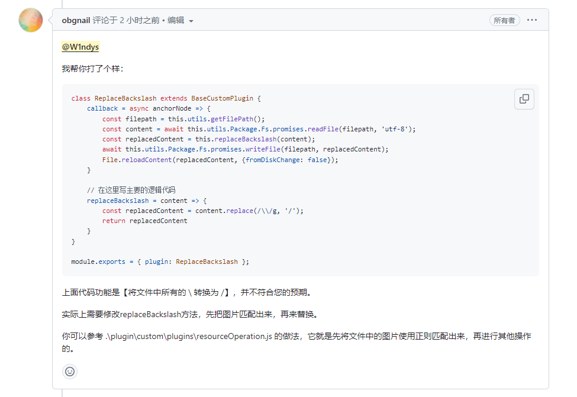
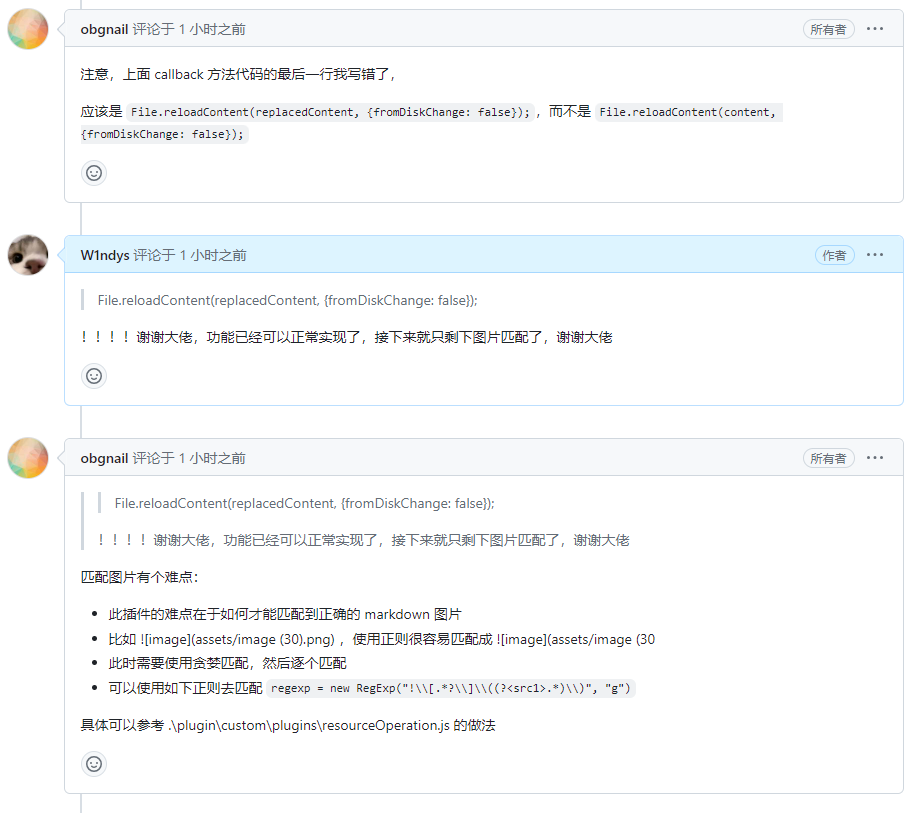
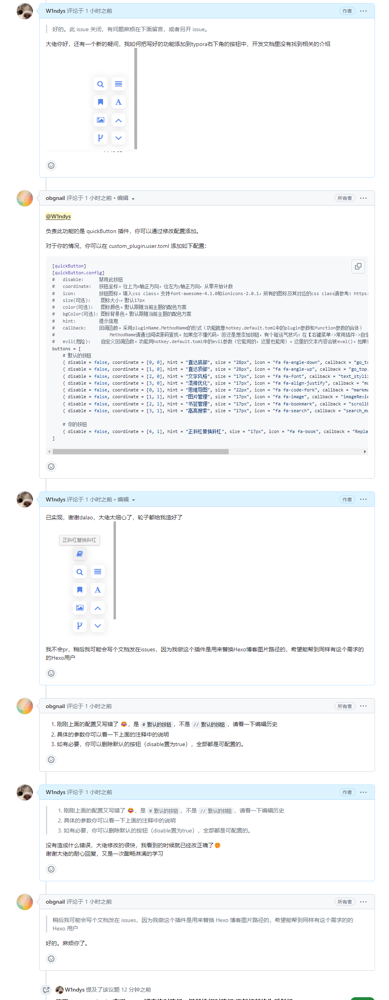
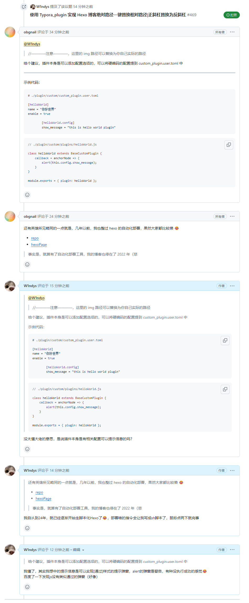
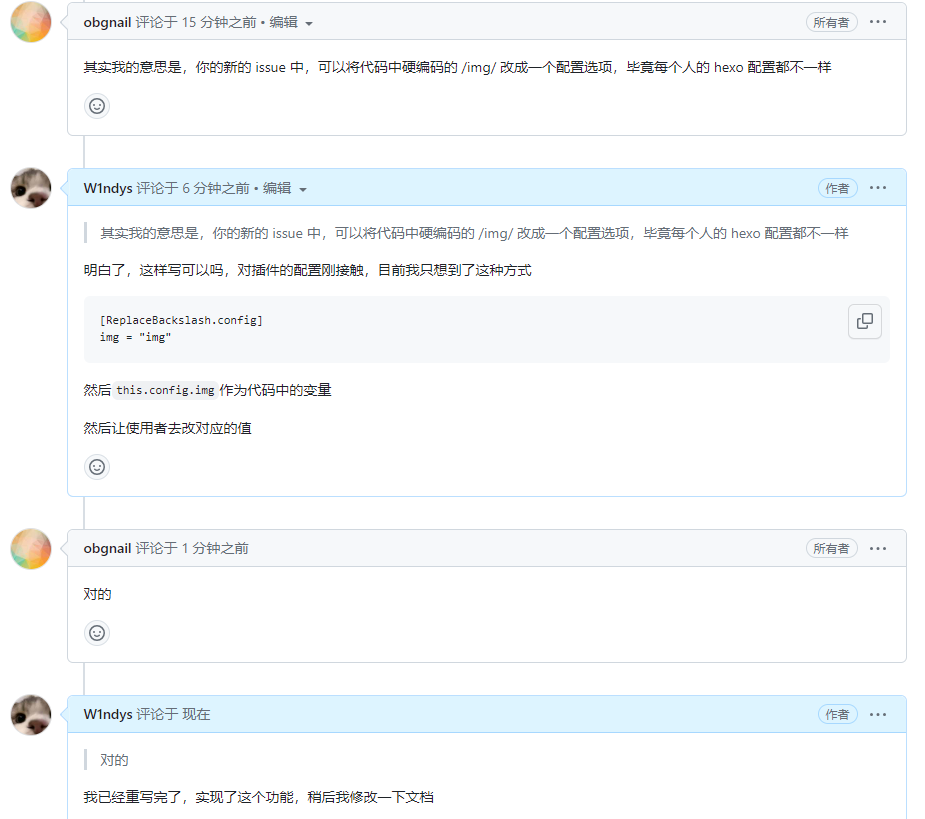
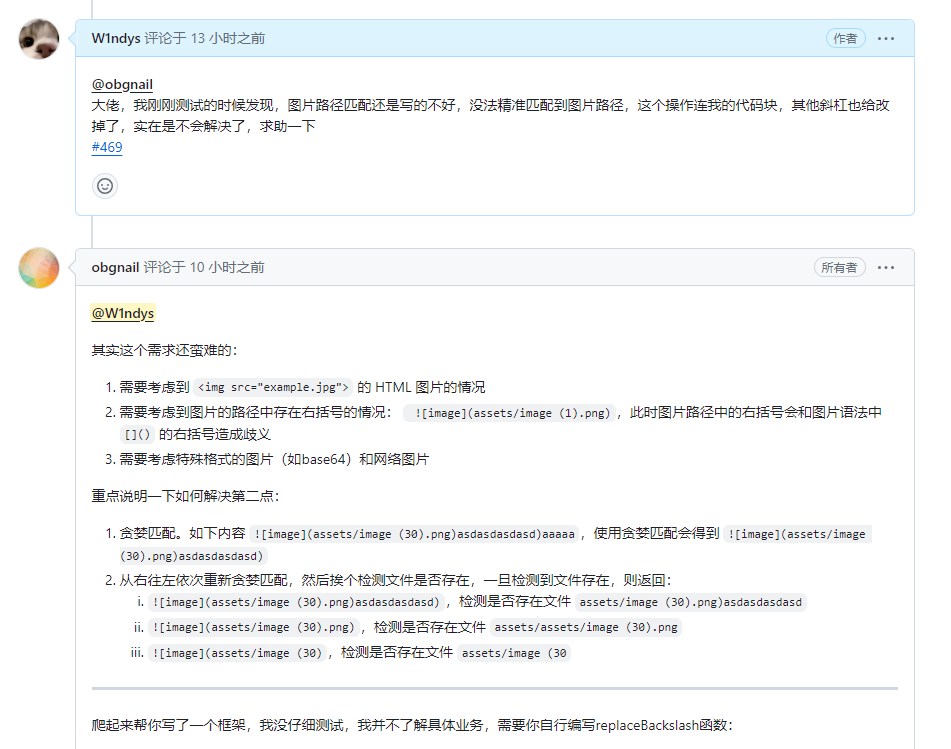

# 使用 Typora_plugin 实现 Hexo 博客绝对路径一键替换相对路径|正斜杠替换为反斜杠

今天下午偶然的发现，解决了我很久以来一直想解决的问题，因为在 Hexo 博客上传的时候我一般是把图片插入进去，但是默认的路径是绝对路径，曾经在 Typora 设置里改过，但是效果也不好，今天想起了 Typora plugin，于是想基于 Typora plugin 开发一个插件

首先感谢 Typora plugin 开发者 https://github.com/obgnail/typora_plugin/

真心感谢插件开发大佬😭😭😭😭😭😭😭😭😭😭😭

我把问题抛给大佬，大佬轮子都给我造好了，而且还有礼貌，我说我写个安装文档提供给其他有需要的用户使用，他甚至还麻烦我











## 脚本适用情况

该脚本主要实现功能是，Markdown 中所有的图片路径中正斜杠一键替换为反斜杠，并把包含../img/的路径替换为相对路径，方便 Hexo 博客上传

例如 Markdown 中文件路径是 `[示例图片](F:/Hexo/source../img/test.png)`

替换后的路径就是 `[示例图片](../img/test.png)`

本脚本适用于：Hexo 博客写作排版，Hexo 图片放在/source/文件下的 Hexo 博客作者

## 安装 Typora plugin

有关插件的安装教程可以看官方的仓库，Readme 写的很详细了

https://github.com/obgnail/typora_plugin/

## 创建 JS

在 `./plugin/custom/plugins/ReplaceBackslash.js` 文件中创建 js 文件，把下面代码复制进去。

```javascript
class ReplaceBackslash extends BaseCustomPlugin {
    callback = async anchorNode => {
        hotkey = () => [this.config.hotkey]
        const filepath = this.utils.getFilePath();
        const content = await this.utils.Package.Fs.promises.readFile(filepath, 'utf-8');
        const replacedContent = await this.format(content);
        await this.utils.Package.Fs.promises.writeFile(filepath, replacedContent);
        File.reloadContent(replacedContent, { fromDiskChange: false });
    }

    format = async content => {
        const dir = this.utils.getCurrentDirPath();
        const regexp = this.config.ignore_image_div
            ? new RegExp("!\\[.*?\\]\\((?<src1>.*)\\)", "g")
            : new RegExp("!\\[.*?\\]\\((?<src1>.*)\\)|.*?)\"", "g");

        return await this.asyncReplace(content, regexp, async (match, src1, src2) => {
            const src = src1 || src2;

            // 跳过特殊格式的图片（如 base64）和网络图片
            if (!src || this.utils.isSpecialImage(src) || this.utils.isNetworkImage(src)) return match;

            // 检测图片是否存在于当前电脑中，若不存在，则不处理
            // 如果不希望检测，可以注释掉下面两行
            const realPath = await this.checkImageExist(dir, src);
            if (!realPath) return match;

            return this.replaceBackslash(match, src, realPath);
        });
    }

    // 替换路径逻辑
    replaceBackslash = (match, src, realPath) => {
        const imgFolder = this.config.img_folder;
        if (src.includes('\\' + imgFolder + '\\')) {
            const newSrc = '\\' + imgFolder + src.substring(src.indexOf('\\' + imgFolder + '\\') + imgFolder.length + 1);
            // 将路径中的反斜杠 \ 替换为斜杠 /
            const replacedSrc = newSrc.replace(/\\/g, '/');
            const index = match.indexOf(src);
            return match.slice(0, index) + match.slice(index).replace(src, replacedSrc);
        }
        return match;
    }

    asyncReplace = (content, regexp, placement) => {
        let match;
        let lastIndex = 0;
        const promises = [];

        while ((match = regexp.exec(content))) {
            const str = content.slice(lastIndex, match.index);
            lastIndex = regexp.lastIndex;
            const args = [match[0], match.groups?.src1, match.groups?.src2, match.index, match.input];
            const promise = placement(...args);
            promises.push(str, promise);
        }
        promises.push(content.slice(lastIndex));
        return Promise.all(promises).then(results => results.join(""));
    }

    checkImageExist = async (currentDir, path) => {
        let absolutePath = this.utils.Package.Path.resolve(currentDir, path);

        while (!(await this.utils.existPath(absolutePath))) {
            const idx = absolutePath.lastIndexOf(")");
            if (idx === -1) {
                return null;
            } else {
                absolutePath = absolutePath.slice(0, idx);
            }
        }
        return absolutePath;
    }
}

module.exports = { plugin: ReplaceBackslash };
```

## 启用插件

1. 修改 `./plugin/global/settings/custom_plugin.user.toml`，添加配置：

```
[ReplaceBackslash]
name = "替换反斜杠为正斜杠"
enable = true

[ReplaceBackslash.config]
# 是否忽略html标签里的资源（markdown是支持插入html的，此选项问是否要忽略img标签）
ignore_image_div = false
img_folder = "img"          #这里引号内的内容改为你自己的文件夹命名
```

这里引号内的内容改为你自己的文件夹命名

## 添加快捷方式

### 添加快捷键

修改

1. 修改 `./plugin/global/settings/custom_plugin.user.toml`，添加配置

在上一步的基础上，继续添加一行代码

```
[ReplaceBackslash.config]
# 是否忽略html标签里的资源（markdown是支持插入html的，此选项问是否要忽略img标签）
ignore_image_div = false
img_folder = "img"
# 快捷键（若为""，则不注册）
hotkey = "ctrl+shift+m"
```

这里快捷键设置为 `ctrl+shift+m` 可以根据自己需要修改

### 添加快捷按钮

在上一步的基础上，继续添加代码

```
[quickButton]
[quickButton.config]
#   disable:      禁用此按钮
#   coordinate:   按钮坐标。往上为x轴正方向，往左为y轴正方向，从零开始计数
#   icon:         按钮图标。填入css class。支持font-awesome-4.1.0和ionicons-2.0.1，所有的图标及其对应的css class请参考：https://www.adfwebmagazine.jp/wp-content/uploads/test_v4.1.pdf  和  https://ionic.io/ionicons/v2
#   size(可选):    图标大小。默认17px
#   color(可选):   图标颜色。默认跟随当前主题的配色方案
#   bgColor(可选): 图标背景色。默认跟随当前主题的配色方案
#   hint:         提示信息
#   callback:     回调函数。采用pluginName.MethodName的形式（功能就像hotkey.default.toml中的plugin参数和function参数的合体）
#                     MethodName请通过阅读源码查找。如果您不懂代码，但还是想添加按钮，有个碰运气技巧：在【右键菜单->常用插件->自定义插件下的插件】基本都是XXX.callback，其余插件基本都是XXX.call
#   evil(危险):    自定义回调函数。功能同hotkey.default.toml中的evil参数（它能用的，这里也能用）。这里的文本内容会被eval()。如果设置此参数，callback参数会失效
buttons = [
    # 默认的按钮
    { disable = false, coordinate = [0, 0], hint = "直达底部", size = "28px", icon = "fa fa-angle-down", callback = "go_top.goBottom" },
    { disable = false, coordinate = [1, 0], hint = "直达顶部", size = "28px", icon = "fa fa-angle-up", callback = "go_top.goTop" },
    { disable = false, coordinate = [2, 0], hint = "文字风格", size = "17px", icon = "fa fa-font", callback = "text_stylize.call" },
    { disable = false, coordinate = [3, 0], hint = "混排优化", size = "17px", icon = "fa fa-align-justify", callback = "md_padding.call" },
    { disable = false, coordinate = [0, 1], hint = "思维导图", size = "22px", icon = "fa fa-code-fork", callback = "markmap.onButtonClick" },
    { disable = false, coordinate = [1, 1], hint = "图片管理", size = "17px", icon = "fa fa-image", callback = "imageReviewer.callback" },
    { disable = false, coordinate = [2, 1], hint = "书签管理", size = "17px", icon = "fa fa-bookmark", callback = "scrollBookmarker.callback" },
    { disable = false, coordinate = [3, 1], hint = "高亮搜索", size = "17px", icon = "fa fa-search", callback = "search_multi.call" },

    # 你的按钮
    { disable = false, coordinate = [4, 1], hint = "正斜杠替换斜杠", size = "17px", icon = "fa fa-book", callback = "ReplaceBackslash.callback" },
]
```

重启 Typora 就可以在右下角看到添加的快捷按钮

### 实现效果


## 更新日志

2024 年 2 月 8 日 ， 修了一处没有考虑到的 bug，原先只能转换绝对路径，对于（..../img/）形式的路径不会处理，修复后也包括了这种情况，具体改动可以查看编辑历史

2024 年 2 月 8 日 ，重写了代码逻辑，改为先进行反斜杠替换，然后进行路径重写为相对路径

2024 年 2 月 8 日 ，增加了一个实现效果 GIF 演示

2024 年 2 月 8 日 ，受作者启发，将代码中硬编码的 ../img/ 改成一个配置选项，脚本使用者可以根据自己需要修改配置变量的内容

2024 年 2 月 9 日 ，代码已更新，经过作者的施教，增强了图片路径的匹配，解决了原先替换全文\的问题，现在只替换图片路径，插件作者太强了

如图




2024 年 2 月 10 日，大佬帮忙抓虫，纠正了快捷键的配置

## 鸣谢

感谢 Typora_plugin 作者，极大地方便了我的写作

感谢 ChatGPT，给了我代码写作的开头

1. https://github.com/obgnail/typora_plugin/issues/467
2. https://w1ndys.top/
3. https://chat.openai.com/

---

文章来自 https://blog.w1ndys.top/posts/520cc65
