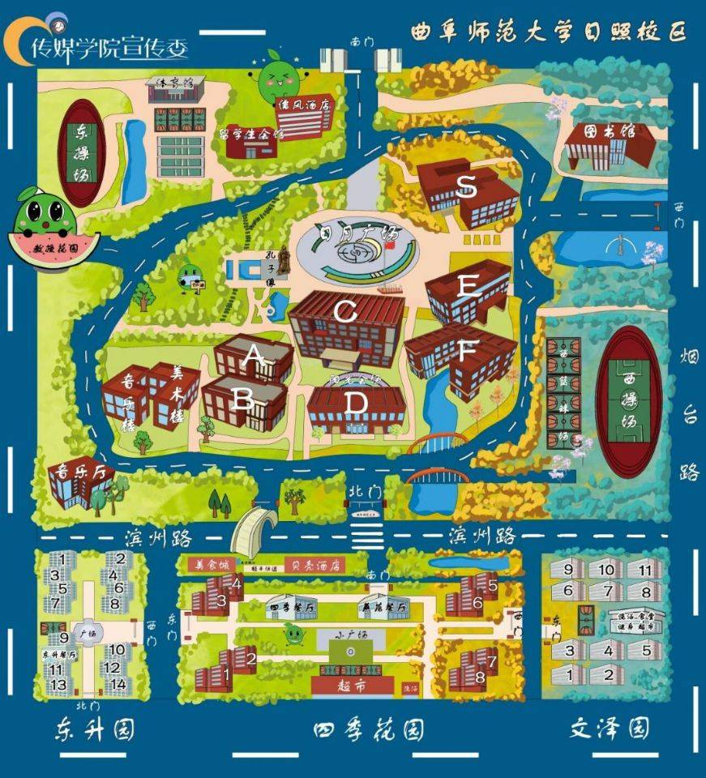
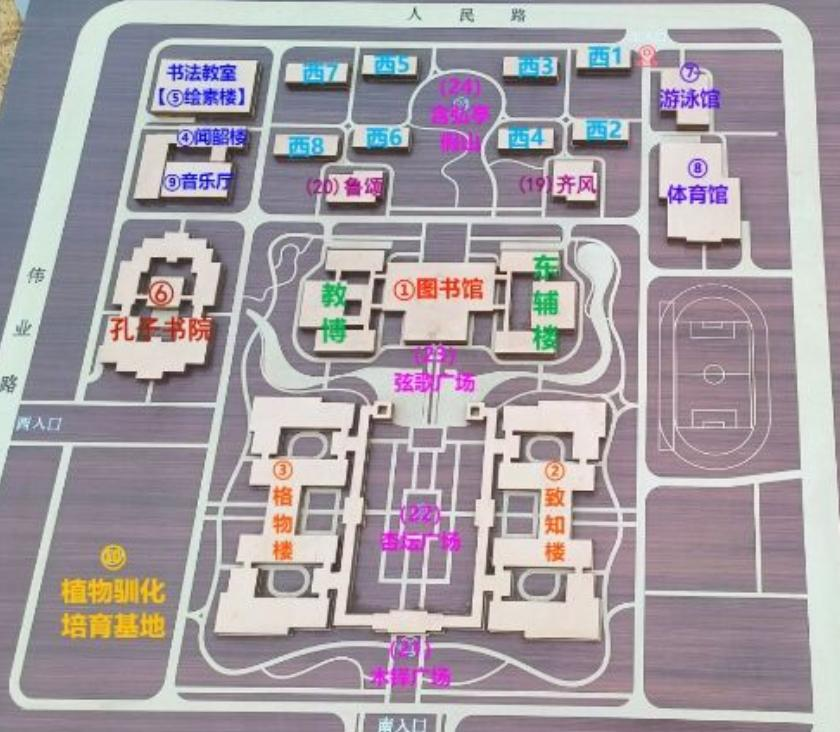
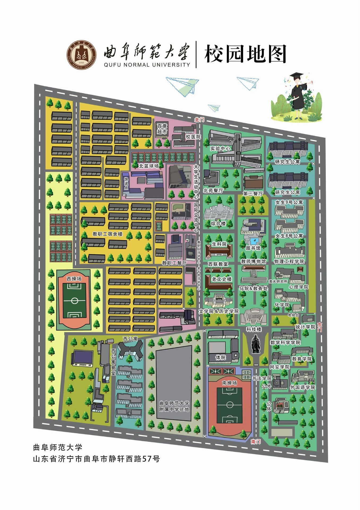
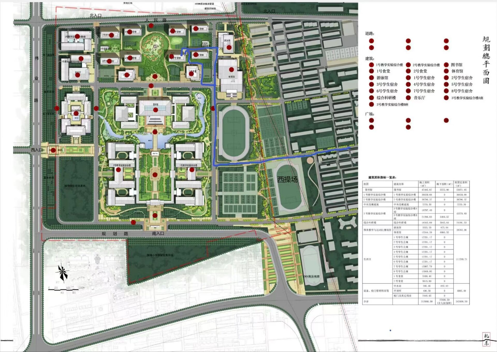

施工中……

---

  公告：暂无  

---

选课推荐可以看这个项目 [曲阜师范大学选课指北项目 - hi！这里是 W1ndys 的小站](/posts/216d9006)

---

# 完善链接

有任何想征求的信息/想补充的信息可以填这个问卷收集：https://wj.qq.com/s2/13050410/11e8/

---

# 关于称呼

一般在曲师大是以 **“师哥师姐师弟师妹”** 相称而不是 **“学长学姐学弟学妹”**，可能因为毕竟是师范大学嘛，即使现在不习惯，入学之后也会慢慢这么改口的。

第一，这也就意味着如果有人自称学长/学姐主动加好友 or 向你搭讪，那么请警惕一些，他有七成可能不是曲师大本校的，并且是想向你推销笔/清洁剂等乱七八

糟的东西；剩下三成即使称呼正确(暗号对上了)，他也有可能是校园卡代理，想让你办卡他拿提成。

第二，这些称呼也只是为了礼貌起见。

# 军训问题

## 1、军训什么时候开始，能不参加吗

预计今年新生入学时间是 9 月 10 日、11 日，不出意外的话军训会在 12 号开始。很多人问关于军训

能否不去的问题……sadly, 军训可以说是你在大学里要修的第一个学分：通识实践教学模块、必修课

程、1 学分，所以如果没有意外情况的话所有同学都是要参加军训的。

意外情况包括但不局限于：

因身体疾病等无法军训新生入学体检会在军训期间进行，如果检查出影响运动的问题学院会让你见

习；同时如果你身体有不适合军训的疾病或不适，如先天心脏病、骨折等，需出示病例向辅导员和

教官告明请假。

因天气原因无法进行军训：仅限于暴雨天气以及突发自然灾害（这个一般不会有）等，毕竟以前小

雨天也是会进行军训的。

## 2、军训多长时间

军训时间跨度一般为两周左右（实际可能不到两周）

## 3、军训干什么

​    首先，军训不需要自带枪支！在分连队之前一般是同学院/专业的在一起军训，这期间的训

练内容一般是站军姿、一些常用口号、以及军体拳。后期会分成表演方队和检阅方队：表演

方队是按照擒敌拳、棍、齐步跑步、内务等不同的种类划分并训练，划分标准得看个人表现

以及你们教官啦，军训汇演的时候自己是什么表演方队就表演啥——我至今无法忘怀总教官

一声令下，内务连一大群人抱着铺盖卷跑上去表演叠被子的场面；检阅方队相对咸鱼一点，

继续训练站军姿啥的，到时候军训汇演就是站在那里喊口号并接受检阅的。

军训期间的晚上一般是上晚自习，期间可能会有部分社团、学生会部门去进班宣传。

## 4、军训准备什么

准备好脑子！虽然军训教官看起来都很严厉，但是他们其实对自己连队都很温柔的，体罚之类的事情很少很少，但前提是你别干不该干的事！

然后是防晒，男生女生如果不想在很长一段时间内丧失择偶权的话建议还是准备好防晒！由于军训的时候要把头发扎起来，所以据女同志建议，涂防晒的时候

包括耳朵也要涂到！男同志也要涂防晒！！为了身体，别不好意思

水杯，军训的时候天气很热，并且不是中学体育课那种想去喝水就去喝水，而是你们教官会规定时间按秩序去喝水……建议搞一个大点的保温杯之类，接凉水放在

那也不至于被太阳晒温。水可以自带，学院学生会也会提供饮用水供休息间歇接取饮用。

## 5、军训着装问题

需要统一着装。从头到脚甚至到袜子都要统一。

袜子的话可以提前准备好两到三双，一般是黑色、可以包住脚踝的长袜（具体颜色到时候会通知），包住脚踝一是为了防晒，二是为了防止扭伤，但是一般要求  全部穿黑色长袜 

​		女生要用黑色头绳把头发扎起来，染了色的最好藏在帽子里不要露出来。

​		军训服装是统一订购的，包括内衬、外套、帽子、鞋子以及军训时使用的马扎，具体订购方式以及价格见随通知书发放的入学须知。

​		鞋子，鞋底很硬，建议不管是男生还是女生都要准备好鞋垫。以前有买卫生巾垫在里边的，吸汗且软效果很好，但是一定要好好粘住不要掉出来，不然就尴尬了简直社死现场。

## 6、军训期间会查宿舍嘛？

​    军训期间会查宿舍的，而且很严，一般查完军训期间就不是很严了，到了大二会变得更松，因为内务也算是军训的一部分，被子要叠豆腐块，床上用品也需要统一（这种时候不统一订购被褥的可能就比较难过了）。

 

## 7、还有没有其他需要注意的？

军训最好不要带手机，带了也没法玩嘛毕竟。军训服是没有口袋的，装袖子里一不小心还会摔坏。当然为了买饭方便带了也没事，在训练开始之前交给自己教官代为保管就好。

女生不要化妆，别美甲，别戴饰品。有那种化了眉去军训，被教官搓掉一条，顶着剩下的一条眉毛军训的先例 23333；男生不必非得留特别短的头发，留长发的话能戴的下帽子就可以。

每天军训出门的时候最好等你的舍友一起，也是增进感情和理解的好机会。别忘了带好宿舍钥匙饭卡啥的，如果没带手机，那甚至还可以揣点现金方便买饭。军训解散了还需要排队回去，中途不能随意离队哦。

总而言之，军训这段时间，是比较严酷的一段时间。挺过来就好了

# 宿舍问题 

> 特别注意，本部分由于作者能力有限，无法做到了解每个宿舍楼，所以希望大家来共同完善 [完善链接](#完善链接)

目前（2023 年 9 月 12 日）学校宿舍有新校区 1-8 号楼八座，西公寓 1-6 六座楼，校三校八校九，校一校二

## 被褥可以自带嘛？

原则上说可以自带，但是推荐跟学校统一订购，一是为了到时候来学校方便，二是军训时候检查内务需要被褥什么的一致。学校订购的包括夏凉被、厚棉被、薄被子各一床，床单两张，褥子两床，枕巾两条，枕头一个，枕套一个，还有一个蚊帐。默认是统一订购的，具体价格以及取消订购方式具体见新生入学须知。

## 宿舍有无线网络/校园网嘛？

很遗憾，无线网络以及网线并不是宿舍标配，建议和舍友商量好是否要扯网线后去校内移动营业厅咨询相关费用。（自北公寓搬到新校区以后，目前来看校内已不允许拉网线）如果使用学校配发的手机卡的话，还可以去校内移动营业厅办理校园网业务，手机可以直连校园网。另外关于校园网，没有选课必须用的说法(如果必须用校园网才能选课的话那 22 级疫情延期开学在家里选课怎么解释)，目前来看一学期一两次的心理测试是需要校园网的，其余无限制，借一个就行，不想欠情分去群里找个人一两块租一个也行。办不办校园网还是看个人所需

>  应国家网络安全法规定，使用校园网等公共网络时为了做安全追踪，禁止开热点，禁止使用路由器、模拟机、虚拟器、VPN、万能钥匙、360WiFi、猎豹 WiFi、手游助手、游戏加速器、信号桥等软件；手机上双 WiFi 加速和 WiFi+功能不要开启。黑名单两个小时后自动解除，请自觉遵守相关法律法规，文明上网。





## 宿舍收水电费嘛？

每个宿舍不一样，新校区是统一用蔚来校园的系统

## 宿舍床位是怎么分的？

已知宿舍房间是学院分好的，而床位则是先到先得——先去报道并到达宿舍的可以自己挑空着的铺。

## 宿舍可以用吹风机嘛？

学生宿舍内不可以使用大功率违规电器如卷发棒吹风机电热毯等，由于部分宿舍电路老化，使用大功率电器很有可能造成跳闸等事故。建议入学后仔细阅读相关材料。

## 宿舍里不能用吹风机的话，洗完头该怎么吹干呢？

宿舍楼基本是每层楼有一个或两个公共洗刷间，配备一台投币式/扫码用吹风机（系统不同收费不同

## 有关于检查宿舍卫生/宿舍会检查卫生嘛？

一般是每周三查宿舍，大一大二大三都查，只不过严格程度不同而已。具体要求入学后会告知。

## 宿舍会查晚归吗？

宿舍不定期查晚归，夜不归宿会扣除一定综合素质分，这个分数只与评奖评优挂钩，不担心奖学金的话可以无视。同时图书馆等校内设施是有关闭时间的，不要想着晚上在学校里某个地方通宵学习……

## 9、宿舍里可以挂床帘嘛？

可以挂床帘，但大一最好别挂，挂了的话检查卫生需要拆下来，过于麻烦。

## 10、洗澡都是大澡堂嘛？

因宿舍而异。新校区独卫独浴，其他宿舍暂时不知道

# 快递问题

## 常用快递站营业时间及收件类型

(包含打印社，摆渡车等时间)

> 特别致谢：本项数据由 22 文院吉祥物鼠鼠独立整理

编者的话：第一次编辑时间 2023.9.10（快递站时间都是去店里问的，初步奠定雏形。）

第二次编辑时间 2023.9.15（添加了收件种类），（打印店涨价到 0.15 一张了）

### 北门校外快递：

#### 曲师大北路菜鸟驿站/教授花园菜鸟驿站【北门左边】：

营业时间：8: 30 → 19: 30 **（最新时间 8：00 → 20：00）**

联系电话：13563727610

收件：只收申通快递

#### 曲师大北门菜鸟驿站【北门右边】：

营业时间：早上 9: 00 →晚上 8: 00 点

收件：中通，邮政

#### 北门西侧京东快递：

早上 9: 00 →晚上 7：00【寄件电话：17865718685】

### 曲师大东门邮政：

#### 东门邮政快递

8: 00 → 12: 00；14: 00 → 17: 00

Tips：如果寄邮政快递【寄快递带好身份证】【纺织袋或者盒子（没有的话纺织带四块钱一个)】

**！邮政银行：周天不上班。营业时间：8: 30-17: 00（大部分业务 17: 00 左右下班）**

### 曲师大百意超市快递：

#### 百意里菜鸟驿站

营业时间：8：30 → 17：30 

！**【忙的时候也会开到晚上 8，9 点】**

收件：圆通、申通、韵达、极兔

联系方式：13345197333；投诉热线：9519666】

#### 百意超市右边顺丰快递：

营业时间：早上 9: 00 → 18: 00

联系电话：17753796345

### 曲师大西公寓快递：

#### 开水房熊猫快收（**西公寓 1 号楼，开水房对面**）;

营业时间：早上 9: 00 → 21: 30

寄快递：韵达

收快递：邮政（普通） 

自取点：多多买菜、美团买菜、淘菜菜

#### 西公寓老菜鸟驿站/西公寓 2 号楼菜鸟驿站

营业时间：9: 00 → 19: 00

联系方式：13853741217//联系方式：13853711358

收件：京东、德邦

【图二第 7 条，指送货上楼】

#### 西公寓浴池旁顺丰快递

营业时间：9: 00 → 18: 30

联系电话：18954083793

#### 西公寓西南门菜鸟驿站：

营业时间：早上 8: 30 →晚上 8 点前

收件：申通，圆通，中通，韵达【邮政、顺丰不收】

PS：【门口告示写的是到晚上 6；30，阿姨说不会那么早关门】

### 其他：

(1)摆渡车：早上 7：00 →晚上 10：00

(2)瑞幸咖啡：7：30 → 20：30

(3)中国移动营业厅【大活旁边】：8：00 → 17：30

(4)西公寓友好打印社：

营业时间早上 6: 30-晚上 11 点前（10: 40/10: 50）

联系电话：15563718990

(5)西公寓浴池旁，友谊打印：

营业时间：6: 30-晚上 11：00

联系电话：15689763591

(5)生活区北门雅迪：13853775048

[查看原图](https://z1.ax1x.com/2023/09/16/pPfu08e.png)

# 北门药店营业时间

> 特别致谢：本项数据由 22 文院吉祥物鼠鼠独立整理

1. 同志药店：7: 30-22: 00

2. 师大北卫生所 7: 30-21: 00【中午一直都有人】

3. 教授花园诊所：7: 30-21: 30

4. 广圣堂大药店：7: 30-21: 30

5. 漱玉平民大药房：7: 30-22: 00

6. 仁和堂药店：7: 30-21: 30

7. 生活区北门同志大药店：7: 30-22: 00 **【联系电话：15864131314】**

 [查看原图](https://z1.ax1x.com/2023/09/16/pPfuwCD.png)

# 曲阜师范大学作息时间表

# 校区地图

> 致谢 22 文院鼠鼠，W1ndys，日照校区颜珞供图





# 曲阜师范大学相关链接

1.曲阜师范大学官网：https://www.qfnu.edu.cn/

2.曲阜师范大学本科招生网：https://zsb.qfnu.edu.cn/static/front/qfnu/basic/html_cms/

3.曲阜师范大学研究生招生网：https://yjs.qfnu.edu.cn/zsgz.htm

4.曲阜师范大学中国教师博物馆：https://tchmuseum.qfnu.edu.cn/

5.edusrc_qfnu：https://src.sjtu.edu.cn/list/firm/4425

6.曲阜师范大学教务登陆 http://zhjw.qfnu.edu.cn/sso.jsp

7.曲阜师范大学教务处 https://jwc.qfnu.edu.cn/

8.曲阜师范大学新生网上报道系统 http://xuegong.qfnu.edu.cn: 8081/

9.曲阜师范大学微博 https://www.weibo.com/qfnu1955

10.曲阜师范大学抖音 https://www.douyin.com/user/MS4wLjABAAAAdMEnRhop5iHeGRtvxqG0KtTwpDXBjT1hbNwB7NyF6Do

11.曲阜师范大学沈秀清主任抖音 https://www.douyin.com/user/MS4wLjABAAAAlISK1oQ28Va76u1RJsM6qNxbCaxQbUvYNc4sULrE4n4

12.曲阜师范大学西校区实拍 https://www.douyin.com/video/7139723100697988366

13.曲阜师范大学高考历年分数线 https://zsb.qfnu.edu.cn/static/front/qfnu/basic/html_web/lnfs.html

# 曲阜师范大学培养方案讲解

> 本项由 22 化院夜雨听风独立完成，特别致谢 

## 曲阜师范大学培养方案讲解一

[曲阜师范大学培养方案讲解一_哔哩哔哩_bilibili](https://www.bilibili.com/video/BV1Sw411i7iP/)

## 曲阜师范大学培养方案讲解二

[曲阜师范大学培养方案讲解二_哔哩哔哩_bilibili](https://www.bilibili.com/video/BV19P411t7T2/)

## 曲阜师范大学培养方案讲解（横版）

[曲阜师范大学培养方案讲解（横版）_哔哩哔哩_bilibili](https://www.bilibili.com/video/BV1CK4y1c7QQ)

# 曲阜师范大学数学科学学院速通指南

> 本项由   22 数科  独立完成，特别致谢



## 如何选择一本适合你的《数学分析》教科书

https://zhuanlan.zhihu.com/p/563317174#/

https://www.bilibili.com/video/BV1xp4y1e7Nh/

## 自编一则

在此我们重申，本指南旨在为想学基础数学的同学提供本科阶段的引导，包括但不限于：

1\. 本科阶段基础课程的学习建议；

2\. 进阶课程与向前沿对接的学习建议；

3\. 数学资源的合理运用。

以上三点的第一点，旨在让同学们尽快从中学的思维过渡到真正学数学的思维，少走弯路，并谢绝成为 "名词党"。

第二点，进阶课程阶段才是加速学习的开始，此时同学们可能会对各种各样的知识都有兴趣，容易迷失方向，陷入东一榔头西一棒子的困境。结合第三点，我们希望本指南最后能做到拓宽同学们的学术眼界，培养学生的学术交流与鉴赏能力。

我们欢迎各方的批评指正。若您对本指南有改进的意见和建议，您可以 QQ/微信告诉本指南的作者，或者发邮件到 657608788@qq。com. 若您有想要补充的内容，请您以 word 文档或 TeX 文 件等常用格式发到该邮箱。最后，祝各位读者同学们学业有成，事事顺心。

值此新春佳节之际，胡志安投资研究中心出品的基础数学修课指南也迎来了新版大放送！

当然我们必须强调：科学上网的同时谢绝一切冲塔行为！！！

前言

众所周知，曲阜师范大学数学科学学院官网上的基础数学方向培养计划每年更新，而课程学习上的具体困难、重点内容、选课建议没有明确列在培养计划中。在一些同学的倡议与组织下，胡志安山顶洞投资研究 中心认为有必要编写一套适用于中曲师大同学的基础数学课程学习指南。

这份学习指南旨在为中国科学技术大学想学习基础数学的同学们提供一些课程学习上的建议，包括但不仅限于：课程修读顺序、课程主要内容、教材与参考书的选取、课程的拓展方向以 及前沿知识简介。我们没有邀请任何老师参与编写这份指南。

（一）本指南的内容提要与精神纲领：

**1.** 难度设置合理，谢绝拔苗助长

本学习指南只讲到 "本研贯通" 的水平为止，再往后同学们各有自己的研究兴趣方向，因此没有必要再进行指导。同时我们有必要声明，这份指南面向的是任何一个对基础数学感兴趣，并且在学习上愿意稳扎稳打而不好高骛远的曲师大同学，并不

是仅仅面向那些成绩非常好的大佬们（不是小子，你跟天才抬啥杠？人家一学期能学五门专业课，你能吗？）。指南中参考书的选取、课程内容的介绍均是按合理的课程难度给出建议或叙述。

**2.** 理清学习顺序，合理运用资源

指南的第一部分给出了基于曲师大培养计划和课程设置的修课流程图。当然，这个流程图只是大致列了一下曲师大常年开设课程的修读顺序，所以也没必要完全按照流程来走，更没必要也没时间每个方向都学一遍。

第二部分则是介绍了网络上数学资源的合理运用方法，包括数学社区 MSE/MO 的使用指南、学术资源的搜索、以及强调常用工具（例如 LaTeX）的重要性。

**3.** 打牢基础知识，切勿一味图快

指南的第三部分介绍的是数学分析、高等代数这两大最基本、也是最重要的基础课。负责这两部分的作者在撰写学习建议时非常谨慎，因为这是数院任何一个学生（包括非基础数学方向）都必须迈过去的坎。我们不主张一开始就学得太难（你有那水平嘛，确实有一边学高代，一边学无穷维泛函的，但讲真话量力而行），也不建议过于重复性地大量刷题，更不建议一开始就强调过多的奇技淫巧。相反，我们认为积累实例、记忆并理解数分、线代的基本语言、 具体计算和证明方法是更加重要的。我们也不赞成在数学分析、线性代数的学习中就加入过多的实分析、泛函分析、拓扑学、微分流形的初步知识：它们可以作为阅读材料与拓展知识出现，但并不适合给大多数同学在初学阶段学习。与其蜻蜓点水地介绍这些所谓的 "升级知识"，不如先让同学们打好数分线代基本功之后直接去系统地学习深入知识。

Ps：本指南不包括 "解析几何"、"代数学基础" 两门课。

**4.** 建立知识架构，形成自我理解

指南的第四部分介绍的是本科二、三年级的（必修）课程。相比数分高代而言，同学们会在这个阶段感到非常明显的难度提升。指南的这一部分主要是理清知识脉络，这样同学们在进行理解、计算、证明的时候就有了动机。同学们在学习这些课的时候，更重要的还是形成自己的理解，消化证明的技术并积累实例、建立知识架构，为后继学习做好准备。我们不建议在此阶段大量做题(当然完成作业题是基本)，参考书集中精力看 1-2 本，切勿囫囵吞枣（会有大批的学生在学完高代后不能理解特征值）。

**5.** 摸索兴趣方向，迎来厚积薄发

指南的第五部分介绍的是本硕贯通课程，适合正常进度下大三、大四或是研究生低年级修读。我们着重强调，这一阶段才是真正适合加速学习的阶段：因为此时大家已经对那些基础知识产生了较好的理解，即将在知识层面迎来厚积薄发。此时，同学们应当根据自己的兴趣，结合培养计划要求进行学习。我们认为本硕贯通课理应快速承接本科课程，并且为同学们将来阅读文献专著、做问题提供必需的公共基础知识。本科生请抛下对 GPA 的执念（不是彻底抛弃的含义哈，GPA 太低毕不了业的呦），并开始考虑自己对什么方向感兴趣、具体感兴趣的点在哪里、以后可能进入什么领域。与此同时，也可以试着思考这些学科的 "核心问题" 是什么------数学家从来不会平白无故研究一个学科，每个学科发展的背后必有它的 leading problem.

（二）数学学习上需要注意的地方：

**1.** 落实核心思想：不要跟风学习，学会独立思考

任何人、任何建议（包括这个指南）都有局限性。同学们在低年级尚未形成自己的兴趣的时候，请切记：不要看见别人（尤其某些巨佬）学了什么就觉得自己也该学这个东西。大部分同学心中可能的确有一个 "榜样" 存在其或多或少会影响到自己的选择，但不要把 "榜样" 奉为圭臬。 接触新的数学的过程中一定要有自己的思考，并通过不断的学习形成自己的理解，从而判断出自己的兴趣点到底在哪里。

**2.** 初步学习之一：不要轻易放弃，学会自寻帮助

同学们不要因为学习遇到困难而气馁，更不要因为自己感觉问题过于 **trivial** 而害怕发问。近代数学家们一两百年的心血凝聚为同学们一两年的学习，说不难那是不可能的。不理解证明方法、做不出具体计算是数学学习过程中再正常不过的现象。遇到困难，你可以请教同学，也可以查阅书籍（例如一些有答案的书籍、其它参考书等）或者网络（例如谷歌, math stackexchange, math overflow 等等），切勿一味闷着头想！

**3.** 初步学习之二：注重核心知识，谢绝奇技淫巧

同学们在学习数分线代时会在某些几十年前出版的习题集（包括全国大学生数学竞赛题）中遇到一些非常技巧化的题目。这些内容有相当一部分早已和数学发展脱节，纯粹就是把人故意考倒，同学们对此可以置之不理。同学们在学习基础课的时候不要让这些奇淫技巧掩盖真正核心的思想与方法。有时间琢磨这些无用之物，不如多去读一些拓展书籍。切记，沉迷于数分线代的奇技淫巧会对你未来眼界格局的塑造产生负面的影响！

**4.** 初步学习之三：注重日常积累，不要做 "名词党"

同学们在学习基础知识的过程中往往学到的都是光鲜亮丽的优美结论，并时不时能见到一些极为巧妙的证明；但在欣赏 "数学之美" 的同时切勿陷入其中，切勿认为数学工作不应该有那些无比复杂的证明或是繁琐冗长的计算。事实上，前人们从零开始到最终证明这些漂亮的结论或是构建一个理论体系，背后 "堆积" 的默默无闻的 dirty work 的数量和复杂程度往往是难以想象的。以后打算从事研究的同学切记：干净利落的结论往往只是一个结果，而证明它背后需要的 dirty work 才是常态，同学们开始阅读一些比较新的文献之后就会对此有所体会。

同样，你会从这份指南上学到很多看上去 "高大上" 的名词。这并不是坏事，但更重要的是在本科前中期打下坚实的基本功，不要沦为一个只会说名词却对基本技术都一无所知的 "名词党"。有了扎实的基本功、足够的积累，到高年级或是博士生阶段，你才能够去真正体会与理解那些前沿的内容。基础不牢，地动山摇！（很多人，抽象代数学不明白都是高等代数欠下的风流债）

**5.** 进阶学习之二：切勿囿于课本，探索核心问题

表面上看数学是根据所使用的方法分类的：分析、代数、几何、概率等等。但是在实际的数学研究中，你面对的是一个个未知的问题。一般来说，大部分的问题都来自于物理（化学、生物等）、几何、概率、信息、数论等领域，只不过解决他们的手段多种多样，衍生出了形形色色的数学理论。然而再抽象的数学，再复杂的定义，都必有引入这个对象的动机或者核心问题。因此学习过程中一定要去试图去了解 "源头所在"。下面罗列的这些就是很好的例子。

泛函分析：初学无一例外地都会觉得抽象和不知所云，然而很多技术实际上来自于对偏微分方程的研究。相似的结论总结出来便成了泛函分析的理论体系。

调和分析：奇异积分 C-Z 理论实际上来自于椭圆方程的 W 2; p 估计，非卷积奇异积分则来自于 Lipschitz domain 上的椭圆方程以及拟微分算子的研究，震荡积分理论则直接是(自由)色散方程的解，自然地又与傅立叶限制性估计问题产生联系。

纤维丛的联络：实质上来自于平行移动的概念，最早可以追溯到 Cartan 的活动标架法（别忘了 Cartan 可是李群大师）。

群上同调：实质上是来自于 Hopf 发现某一类特殊的空间，其同调由其基本群所完全决定（比如黎曼面（P 1 除外））。

举这些例子，实际上就想提醒大家：所有能留下名字的数学都起源于对具体且重要问题的研 究；不知道任何动机和例子的抽象学习，极度的容易遗忘。另一方面，若能挖掘出一个理论背后的动机或者核心问题，学习起来也会相对的愉悦轻松。学数学不是单纯地死记硬背与抄书，更需要你的直觉与判断力。

**6.** 进阶学习之三：切勿局限 "方向"，本科只有 "倾向"

实际上几乎所有的老师也都持有这个观点。现实地讲，同学们以后做的方向很大程度上取决于你最后去深造的学校与想跟的导师，并非百分之百如你所愿。而从数学本身出发来看，不同的领域之间都是密切交织着的，很有可能将来就会碰到其它领域的知识点。例如：一个做几何拓扑的人很可能要去学习很深的代数几何知识来解决拓扑问题，(环面上)薛定谔方程的研究会用到解析数论的结果，流体力学中某些问题的研究工具来自于广义相对论的数学理论，调和分析中的震荡积分/傅立叶限制性估计与几何测度论、解析数论甚至组合数学这种看上去毫不相关的领域有着非常紧密的联系。因此，本科期间切勿认为我就是学 **XX** 方向的，然后从不关心其他方向乃至下意识反感。这对未来的发展都会埋下隐患。

**7.** 走向研究之一：前沿飞速发展，时刻跟进学习

信息时代的潮流下，学术界发展越来越快。如今具有发展前景的方向，其核心问题也许就在几年后被解决。所以同学们走向研究之后要时刻保持跟进学术界的发展并不断学习新知识，莫妄想学一套技术吃一辈子。

**9.** 走向研究之二：正确选取课题，谨慎寻找导师

好的研究课题种类很多，但一定不是你自己瞎编条件造出来的问题，也一定不是照葫芦画瓢就能做出来的边角杂碎。而导师的重要性更不必多说：初期能在背后为你撑腰的人只有你的导师（可能还有你的同门前辈）。导师是否负责（这个不能强求，每个人最适合的导师类型也不一样），是否能给合适的课题与必要的引导，是否愿意为学生在找教职时帮一把，本身是否具有足够的能量，都是需要考量的因素。PhD+一站博士后至少是八年，因此同学们的眼光一定要放长远一些：在学习研究的过程中一定要不断地思考、探索，以便敏锐地察觉到哪些方向可能即将迎来蓬勃的发展。一旦意识到这是个可以开拓但尚未开拓的方向，就要果断地投入时间和精力，而不要原地踏步浪费青春。

**10.** 走向研究之三：导师不是保姆，学会独立研究

导师是给你学术建议、导引的人，而不是你的监护人。从来不是 "导师说什么我就非得去做什么"，从来不是 "导师给的题目就是我要考虑的全部"。实际上导师的任务并不是给你布置作业，更不是天天指手画脚，而是随时准备解答你的具体问题，而最终的研究课题是要由你自己去完成的。你对某个课题有想法，可以咨询并参考（不是非要采纳）导师的意见，也可以自己先试试看，实在不行了再说。读一个 PhD 下来，要慢慢从导师眼中的 "学生" 上升为 "合作者" 平起平坐地交流，而不是导师对你已知单方面输出。这个过程对培养你自己的独立思考能力、研究课题选取能力乃至独立研究能力至关重要。

（三）数学学习之外需要注意的地方：

结合科情科况，我们提醒大家，一些数学之外的因素同样非常重要。

**1.** 英语学好，勿忘中文，走遍天下

无论你在哪国读数学，英语都是你在数学世界里面用于交流的共同语言（当然和中国人交流肯定说中文了）：写论文、听报告、讲报告、开会学术交流等等场合，你的遣词造句能力、表达与人际交流能力都是非常重要的。

**2.** 谢绝绩点洗澡，选课量力而行

低年级有很多非数学课（最傻逼的大物实验和普物/政治/体育/公选/英语）也占用时间，同学们选课需要安排好，专业课的超前学习需要兼顾基础课的正常学习，不要出现基础课/非专业课考一堆六七十分甚至不及格的尴尬，否则对你未来只有坏处没有好处。在这些非专业课上花一点时间不会太耽误你学数学，例如 "科学选课"、"点名不要缺课"，实验报告、课堂展示还是要花点心思完成。我们并不提倡 GPA 洗澡学，但 GPA 的确是你走向深造必需的硬性指标！

**3.** 锻炼信息搜索，注意眼界塑造

信息时代早已来临，当下一味的闭门造车大概率是没有前途的。同学们（尤其是中高年级的同学们）的眼光不要只局限于 "现在学了什么以后就得做与之相关的东西"。本科生的阅历比较单薄，获取信息的渠道也十分匮乏，因此想在各方面独立地做出有远见的判断是很难的。同学们若对某方面有感兴趣，可以去查阅那些经典的文献，或是咨询从事这方面研究的老师与前辈们以获取更多更广泛的信息。这些不经意间培养的信息搜索能力与眼界格局的塑造，往往会在关键时候助你 "逢凶化吉"。

**4.** 切勿盲目跟风，要有自我规划

人云亦云很容易演化成 "东施效颦"，因此同学们在本科期间找到适合自己的出路是非常重要的事情，这需要通过你不断地学习新知识，攫取新信息，并加以自己理性的判断。同学们请切记各个领域方向本无高低贵贱之分，不要陷入某些固化思维，不要被网络上一些 "所谓的大（s）V（b）" 忽悠得人云亦云，更不要有 "万般皆下品，唯有 **XX** 高" 的错误思维！可以看见，走学术道路有很多因素都需要你去斟酌，也需要不少运气成分。要做到这些很难，但机会往往只给那些有准备的人。这些建议大多都来自于我们或者其它同学们曾经走过的弯路，我们希望后辈们不要再浪费时间在这上面。如果哪天你踩了我们踩过的坑之后能想起来我们在指南中提到过这一点，那这份指南也算是尽其所能。我们欢迎各方的批评指正，本指南也会不定期地继续更新，希望各位老师和同学们都能多多支持。

一切的根基：数学分析、线性代数

**3.1**

数学分析

建议教材：常庚哲、史济怀：数学分析教程（第三版），中国科学技术大学出版社。

注：此教材正文的讲解非常详细，可读性也较好，另一套讲得很好的中文教材张筑生的《数学分析新讲》可作为参考书。同学们可以在学习一段时间之后阅读一些拓展知识，见识并计算一些有趣、有用的例子，比较好的选材主要来自于傅立叶分析、微分方程和微分几何等。

主要参考书：

\[1\] 谢惠民、钱定边、易法槐、恽自求：数学分析习题课讲义（上册）（的部分例题）；

\[2\] 裴礼文《数学分析中的典型问题与方法》

\[3\] 梅加强《数学分析讲义》

\[4\] 张筑生的《数学分析新讲》

\[5\] 汪林：数学分析中的问题与反例；

\[6\] Walter Rudin: 数学分析原理；

\[7\] Spivak: 流形上的微积分，齐民友、路见可（译）。

\[8\] 齐民友：重温微积分。（学完之后可以回顾一下，加深对知识的认识）。

查找一些较难、较技巧化的习题答案，可以参考周民强的《数学分析习题课演练》或者裴礼文的大板砖，但仅限于查答案。

学习建议：

裴礼文《数学分析中的典型问题与方法》

对于考研来说是不错的参考书，你如果有毅力有恒心，刷完三遍，山大层级随便选。书中选取了大量的考研真题作为例题和习题，共一千一百余页，认认真真刷完或许可以成为一个考研高手，最起码混个数学竞赛一等奖，应该不啥大事。有不少题目是非常有韵味的，谢惠民从中摘取了一些题目。也有独特的板块，例如上半连续，等度连续讲的比其他参考书细。缺点是缺乏深度和广度，仅仅是为应试诞生的，不利于真正地学懂和打穿数学分析，做完的感受往往做完就忘，看见原题非常眼熟记得思路但写不下来过程，同样题型换条件结论就没有思路，以我举例好几个章节我刷了三四遍了，照样写不下了，也能是我比较随性的缘故。书的外形上令人比较反感，纸小书厚，不利于翻阅，像砖块，俗称 "裴砖"。

李傅山《数学分析中的问题与方法》

前者与裴礼文差不多，都是考研读物，一元微积分中有些内容是相当不错的，可以作为谢惠民的补充，基本上考曲师大人手一本，李傅山也是曲师大著名教授

3\. 梅加强《数学分析讲义》

多元微分积分学强烈推荐，书中含有作者比较独特的思想和内容 (在连续函数部分讲了定积分的定义和性质），升级内容（如余面积公式, Riemman-Stiltjes 积分，微分形式的 Stokes 公式)，内容流畅，挖坑必填。建议看出版后的书，(比未出版前的网传 pdf 版本厚了一倍)。

4.张筑生《数学分析新讲》

作者花了很大心思安排内容的叙写，很有想法，条理非常清晰，通俗易懂容易学习，适合精读，是我个人认为相当适合作为教材的一本。多元部分比较好，微分几何引入的比较全面，在其中（比如在向量值函数板块）看到了不少 Rudin 的影子（应该是借鉴了 Rudin)。比较印象深刻的是在隐函数部分讲的二维 Brouwer 不动点定理。最大的缺点是没有习题。

5\. Rudin《数学分析原理》

比较升级的书，俗称 Baby Rudin, 汲取了很多精华，Rudin 三部曲都很有必要细读。（不适合没天赋的初学者，言辞精炼，思想观点相当不易理解）据说如果不读 Rudin 会难以 get 到大佬的槽点，讨论话题，介绍了不少高级的概念（如隐函数板块的秩定理, 这也是黎曼几何的预备知识）。印象比较深刻的是 Rudin 上介绍了换序逐项求导的加强命题，弱化了条件 (即不再需要导函数一致收敛）, 大多数的书籍不讲这个命题。

7.  菲赫金哥尔茨《微积分学教程》：读过，买过，看不下去一点，买了就留着吃灰的。

8.  吉米多维奇《吉米多维奇数学分析习题集》争议较大的书籍。虚假的数学分析习题集, 其实应该是微积分习题集。包含了大量的计算题, 而且多为繁琐 (典型的俄罗斯风味), 非常复杂的数据使得读者没有做下去的欲望。

9\. 陶哲轩《陶哲轩实分析》

名字虽取实分析, 实际上还是在讲数学分析。初学比较好的教科书, 能够跟随作者体会到分析的乐趣, 感受到数学的整体化, 搭建积木般构建数学的框架。很早就加入的度量空间等泛函分析中的概念, 但是文风亲民, 对后继课程有一定引导作用。兴趣类读物, 读完可能不太会做题。

10.楼红卫《微积分进阶》《数学分析要点难点与拓展》《数学分析技巧选讲》

复旦内部讲义, "楼分析" 的教材, 思想独特的一套书, 亮点在于函数的逼近, 利用逼近的思想使得许多题目变得尤为简单, 但是这些技巧不适于写在答卷上, 从某种意义上这些奇 淫技巧并不是很有作用, 但可以开阔眼界。

11\. 汪林《数学分析中的问题与反例》

最好的查找反例的书籍 (工具书)。作者还编写了《实分析中的反例》等等一系列关于反例的书籍。平等的满足每一个想抬杠的娃娃，平等的赛上每一个人物数分证明没用的新生的嘴。

**3.2**

线性代数

建议教材与参考书：

\[1\] 丘维声《高等代数-大学高代代数课程创新教材》《高等代数学习指导书》

\[2\] 姚慕生. 谢启鸿《高等代数学》(绿皮)+《高等代数》(白皮)

\[3\]  Sheldon Axler《线性代数应该这样学》

次要与进阶参考书：

\[4\] 柯斯特利金《代数学引论》；

\[5\] 李文威教授的《代数学方法》； 

\[6\] R.戈德蒙特《代数学教材》；

学习建议：

**1.** 总体建议：这门课是数学系课程中最为基础的一门课之一。整体难度并不是很大，但是由于：

（1）线性代数与大学之前的数学课和数学分析有一定区别，从这里开始，我们将慢慢进入抽象的数学；

（2）Jordan 标准型理论和有一定的难度，可能需要花一番功夫。因此不论同学们接下来要学什么方向，希望在学习这门课程时不要太松懈。接下来是这门课的一些学习心得和建议。首先，建议补一点集合论的知识，比如要熟悉单射，满射，双射，一一对应，可逆映射，映射的原像集这些说法，这将对今后的学习大有裨益。

推荐的话，尤承业的《基础拓扑学讲义》引言部分后半段 3 页的内容足矣，这部分希望能够牢牢掌握，都是最基础的集合知识与运算。（或者部分年的代数学基础课程会讲，但不保证）

**2.** 学习动机：

（1）解线性方程组：线性方程组是数学中最简单的一类方程组，并且我们有完整的算法可以求出它的解，即线性代数课程最开始要学的 "高斯消元法"。但是线性方程组的问题还没有彻底解决：如何不解方程组直接依靠系数判断方程解的存在性？对于某些特殊的线性方程组，有没有公式表达它的解？最简阶梯形中的非零行个数是否唯一？......还有许多类似这样的问题，为此会引入线性空间，矩阵，行列式的概念与方法。使用这些工具，在解决关于线性方程组的一些理论问题时，会轻松不少。而反过来，发展线性空间，矩阵的理论时又离不开解线性方程组。可以

说，线性方程组的理论与空间，矩阵的理论相辅相成，共同构造出了线性代数的主干。

（2）解析几何的高维推广：在大一的解析几何课上学过学过三维欧式空间的解析几何，用的方法是点变换/坐标变换等，那么自然会提出一些问题：有没有高维的空间？在高维的空间研究几何能不能用类似的方法？实际上，高维的空间在数学上可以形式地构造出来，并且研究其中的一切的根基：数学分析、线性代数 "几何" 也确实能够用解析几何中坐标变换的想法（并且是核心想法），而且能够用统一的语言去描述这种 "操作"，这就为研究高维的几何带来了极大的便利。

（3）数学对象的抽象化：在高中和大一上的时候已经学过了不少数学对象（集合与元素）以及一些运算操作（映射）。在学习的过程中，可能会发现它们冥冥之中的一些共性：

**3.** 学习内容：

工具性内容：线性方程组理论、矩阵与行列式理论；

核心内容：线性空间理论、线性变换理论、双线型理论；

工具与核心内容的联系：学习线性代数切勿孤立地去学某一项理论，下面列出几点重要联系：

(1)用矩阵表示线性方程组，系数矩阵与增广矩阵的定义；

(2)初等方阵与矩阵的乘法、初等变换的关系；

(3)给定一组基下，可逆方阵与线性空间所有基的关系；

(4)给定两组基，矩阵与线性空间之间的线性映射的关系；

(5)矩阵的相抵与线性映射在不同基下的方阵；

(6)给定一组基，方阵与线性空间的线性变换的关系；

(7)方阵的相似与线性变换在不同基下的方阵；

(8)给定一组基，方阵与线性空间的双线性型的关系；

(9)方阵的相合与双线性型在不同基下的方阵。

**4.** 学习方法

(1)线性方程组要熟练，少出错，它是线性代数大部分计算的核心；

(2)注重定义和概念的理解，尤其是不同理论中均会涉及的概念，比如矩阵的秩，培养多角度看问题的习惯；

(3)可以尝试自己梳理线代的脉络与思路，包括证明，除去个别繁琐的证明（分块乘法合理性，Binet-Cauchy 公式，Jordan 标准型理论中关于幂零方阵的 Jordan 标准型等），大部分证明都能够自己证出，理解后并不是很难。如若一时不太清楚定义，命题的表述和证明，可以先记住，然后多与老师同学探讨，并在之后的学习中联系其他的理论思考。

**5.** 延伸与拓展阅读：

在学习完教材的基础内容后，可以参考如下内容。当然部分内容可以与线性代数同步学习。

(1)多重线性代数：这是线性代数中的重要一环，即张量。张量在线性代数中可以用多重线性代数的观点来较为简单的定义，而在模论中则主要会用到泛性质。科大的线代大纲里是不包含张量的，但是到了学微分几何、微分流形、黎曼几何等课程的时候却会大量运用，老师也只会草草讲过。

(3)教材\[3\] 可以用于了解群、环、域的定义：群、环都是现代数学中最为基本的代数定义，它 们跟线性空间一样，是对已有事物的抽象化；域则是一种特殊的环。学习群、环不仅是为近世代数做准备，还能深化已经学过的线性代数的理解。如果学过了群环域的基本定义，可以思考如下几个问题：

\_x000F\_ 线性代数中的数域跟一般域的区别与联系，线性代数的所有结论能否推广到一般域上。（注意这里有两个概念，一个是域的特征，一个是代数闭域）

线性空间的定义中，数域可以换为域，如果换为环呢？特别地，如果换成整数环，我们得到什么？换作域上的一元多项式环，我们又会得到什么？后者与我们学的线性变换有何联系？

线性代数中存在大量群的例子，是哪些？

(3)另外如果又有对矩阵技巧感兴趣的同学，可以参考方保镕的《矩阵论》。

(4)后续课程有李代数、群的线性表示理论、同调代数、微分流形、泛函分析等，计算方向则有数值代数。

书籍品鉴

1，丘维声《高等代数-大学高代代数课程创新教材》《高等代数学习指导书》

最全面的教科书之一，涵盖了大量的例题习题，考研重点参考书。上册不是很难，读起来比较流畅，下册思想深邃 (会涉及一些抽象代数李代数的内容)，会有一定阅读障碍。指导书和创新教材几乎内容一致，只需要创新教材就可以了。最精华的部分在于多项式和 Jordan 标准型，例题丰常丰富，介绍很详细, 但是也正是因为详细, 使得书十分厚重 (尤其下册)，需要四个月才能读完一遍，下册有许多内容牵涉过多后续课程 (大多会打星号), 初学者可以跳过这些内容(你不跳过你大概率也看不懂)。上册虽然浅显, 但是题目典型, 面貌清晰; 下册深邃，阅读难度大，需要毅力。

2\. 姚慕生. 谢启鸿《高等代数学》(绿皮)+《高等代数》(白皮)

绿皮是教材，指导书俗称白皮书，复旦经典流行教科书。较薄易读, 总体难度适中, 没有丘砖难, 可以看作丘维声的浓缩版，但是 "麻雀虽小，五脏俱全"，内容介绍也非常全面，不乏经典的技巧, 每章配置了训练题供巩固提高。书中视矩阵为代数, 视线性映射为几何, 揭示了矩阵与线性映射的共性与不同。如果时间紧张可以选择姚慕生是一个不错的选择, 性价比较高。谢启鸿每周一题是白皮书的强化版 (可在谢启鸿博客上找到), 许多题目非常具有韵味, 选材许多来自于诸如代数几何之类的后续课程, 需要依赖到白皮书上的一些结论。最重要的是在 B 站有配套谢启鸿独家视频讲解（我好大面子哎，能听到复旦的课堂！）

进阶版

拉倒吧，如果你真有实力看完一本，基本上大学数学你横着走，真的，横！着！走！0 你可以试试李文威的那一本，你看看你能看几页？



# 捐赠

 随意捐赠，不作任何额外说明，不道德绑架，不强制，完全看个人想法 

曲阜师范大学速通指南是一个非盈利项目，项目运营均依赖作者资金和精力以及各种形式的捐赠，捐赠资金将全部用于服务器、域名以及其它运营支出，若你也想帮助这样一个项目更好的走下去，可以通过[我的邮箱（w1ndys@outlook.com）](/html/email)联系我    





> 本文基于 [17 物理 nnnn《曲阜师范大学曲阜校区常见问题》编写](https://share.weiyun.com/qcUYtvjq)